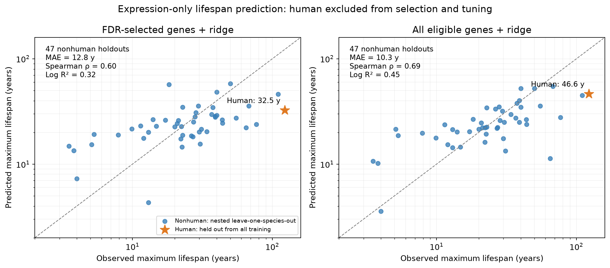

# Predicting lifespan from GI hepatocyte expression

For genomic FASTA → GI expression API → saved regression, including the GRCh38 reference values, see the [sequence-to-lifespan manual](../gi-longevity-final/USAGE.md). The [final artifact guide](../gi-longevity-final/README.md) links this model to the original 30-hit screen and six-gene shuffle experiment.

Both regression models improve prediction of nonhuman mammals over the constant baseline, but **substantially underpredict human maximum lifespan**: **32.5 years** from statistically selected genes and **46.6 years** from all genes, versus **122.5 years** recorded in AnAge. This human validation is unsuccessful: comparative predictive signal does not yield an accurate human estimate.

The human outcome was held out from feature selection, preprocessing, ridge-penalty tuning, and fitting. The target is **recorded maximum lifespan**, not life expectancy. Human AnAge maximum lifespan is **122.5 years**; it was compared with the frozen predictions only after fitting.

| Model | Nonhuman CV MAE, years | CV RMSE, natural-log years | CV Spearman | Human prediction, years | Human error, years |
|---|---:|---:|---:|---:|---:|
| FDR-selected genes + ridge | 12.85 | 0.644 | 0.597 | 32.53 | -89.97 |
| All eligible genes + ridge | 10.33 | 0.582 | 0.686 | 46.56 | -75.94 |
| Training geometric-mean lifespan | 14.96 | 0.801 | N/A | 22.34 | -100.16 |



[SVG](heldout_predictions.svg) · [PDF](heldout_predictions.pdf) · [All nonhuman holdout predictions](cross_validation_predictions.csv) · [Human predictions](human_validation.csv)

The FDR-selected final model uses **57 genes**: ABHD4, LGI1, TDO2, CCDC85A, ARSK, ACSS1, RPS6KA3, AK8, TMEM174, PRPF40A, ATG14, TGFBR1, CPLX4, PTDSS1, HELLS, MARS2, WDFY1, SLC12A1, PCNX3, DSTYK, KRT4, BMP6, CRHR2, ASCC1, SPC25, SPATA46, MTERF3, ITGA3, MID1, RBM26, RBM46, POFUT4, ALX4, PLA2G4B, RGS1, SCUBE3, NEUROD6, TRAF3IP3, FGF7, PARG, RPE65, HSPB8, DCAF17, PHLDA3, RSU1, PRKAR2A, MSANTD4, IRX6, TMEM67, TMEM198, CALB1, TGFBRAP1, ABCB8, MDFIC, CCDC39, ENSG00000170464, NDRG1. These are selected anew using only the 47 nonhuman mammals, rather than reusing candidates from the earlier screen that included humans. The final ridge penalties are 100 (FDR model) and 0.01 (all-genes model). The all-genes model retains 3036 genes after training-only availability and variance filtering. [Gene screen](nonhuman_gene_screen.csv) · [Regression coefficients and preprocessing](coefficients.csv).

## Methods

- Inputs: the completed run of 3,036 orthologues across 48 mammalian species. Each feature is GI `expression_log_tpm`; GI model `g0-expression-8192`, description `Homo sapiens primary hepatocytes, untreated, bulk RNA-seq.` for every species. No shuffled sequences enter this predictor.
- Target: natural logarithm of AnAge maximum lifespan in years. Predictions are exponentiated without a log-normal bias correction; they estimate a lifespan on the log scale, not an arithmetic conditional mean. No ancestry, body mass, species identity, or missingness indicators are predictors.
- Fixed held-out species: Homo sapiens. All 47 remaining mammals enter nested validation, including species with incomplete expression coverage. The available expression matrix and human sequences may be known, but human lifespan is never supplied to a model-selection or fitting function.
- Training-only eligibility: an orthologue must have measured predictions in at least max(10, ceiling(0.6 × training-species count)) species. Zero-variance features are dropped after training-median imputation. Training means and standard deviations standardize each feature; validation and human features receive those same transformations.
- Selected-gene model: pairwise-complete, two-sided Spearman association with training log lifespan, with tie-aware ranks and SciPy's asymptotic t p values. BH FDR ≤0.05 over the prespecified 3,036-gene family; ineligible genes get p=1. Screening uses observed values, not imputed observations. This approximate screen differs from the earlier permutation association screen. If no genes survive in a fold, predictions use the training mean log lifespan.
- Regression: ridge minimizes sum of squared log-lifespan residuals + alpha × sum of squared standardized-feature coefficients, with an unpenalized intercept. Penalties 0.01, 0.1, 1, 10, 100, 1,000, 10,000 and 100,000 are compared using five shuffled inner folds (seed 20261004), minimizing pooled validation MSE. Numerically tied penalties prefer stronger shrinkage. Screening, imputation, and scaling are refitted in each inner fold.
- Evaluation: outer leave-one-species-out CV across the 47 nonhuman mammals. Each outer training set runs its own five-fold inner tuning. Thus each reported prediction is excluded from every step producing it, including gene selection. The baseline is the geometric mean lifespan in each outer training set.
- Baseline ranking is omitted: leave-one-out training-mean predictions vary inversely with the held-out target by construction, so their Spearman correlation is not a meaningful comparator. Compare the baseline by prediction errors.
- Human prediction: rerun the same five-fold tuning and fitting on all 47 nonhumans. `human_prediction_frozen.json` is written before the evaluation routine reads the human target. No choice is made between the two model families based on the human result. Both are reported alongside the baseline.

The exported prediction formula is `log(lifespan_years) = intercept_log_years + sum(coefficient_standardized[j] * (imputed_expression[j] - training_mean[j]) / training_scale[j])`. Missing expression uses `training_median[j]`. The `coefficient_original_scale` column is the standardized coefficient divided by its training scale; using it without centering requires intercept `intercept_log_years - sum(coefficient_original_scale[j] * training_mean[j])`. The supplied inference script applies the centered formula directly.

## Interpretation and limits

This is a small comparative prediction experiment, with 47 training species and thousands of possible features. The species-wise validation allows related species in training, as requested; ancestry is not corrected. Human prediction therefore tests a new species within a dataset containing other primates, not transfer to an unseen mammalian order. Human maximum lifespan also exceeds the largest nonhuman training target (110 years), making it an extrapolation test.

Coverage varies sharply across species. Training-median imputation lets every species be tested but can pull sparsely covered species toward the intercept; the CV table reports both overall coverage and how many fitted features are observed. Coefficients describe conditional prediction after shrinkage and are not causal gene effects. Original six-gene associations are not assumed to transfer to this independently screened model. One held-out human outcome is an illustrative check; it cannot by itself establish general predictive validity.

For the all-gene model, the 23 species below the median coverage of 2,059 observed genes contribute 65.8% of total absolute log error. Their MAE is 12.39 years, versus 8.36 years in the 24 better-covered species; mean absolute log errors are 0.558 versus 0.278. Sparse coverage contributes to poorer prediction, but is not the only difficulty: the well-covered blue whale is also markedly underpredicted. Human coverage is 3,034/3,036 all-gene features and 56/57 selected features, so missing human expression cannot explain the large underestimate on its own. [Coverage diagnostics](coverage_diagnostics.csv).

## Reproduce

The compressed expression matrix, nonhuman targets, gene annotations, fitted coefficients, fold predictions, and provenance are included. These contain expression and lifespan data only, without DNA or API credentials.

```bash
uv sync --extra analysis
OPENBLAS_NUM_THREADS=1 OMP_NUM_THREADS=1 uv run python -m longevity.gi_lifespan_predictor \
  --prepared docs/gi-lifespan-predictor --output /tmp/gi-lifespan-predictor-reproduced
```

The prepared-input command regenerates nested CV and frozen human predictions without needing the original dataset or reading the human target. Add `--human-lifespan-years 122.5` to additionally create human evaluation artifacts; the argument is used only after the fitting routine has frozen predictions. The original full-data invocation uses `--source data/datasets/gi-hepatocytes-ensembl116/analyses/broad` instead of `--prepared`.

To apply the exported model to another numeric expression table (species as rows, first column species name, remaining columns human Ensembl gene IDs; missing genes are imputed using saved training medians):

```bash
uv run python scripts/predict_gi_lifespan.py --expression-csv expression.csv --output lifespan_predictions.csv
# Add --model all_genes_ridge to use the model without association screening.
```

[Source provenance](source_provenance.json) · [Protocol](protocol.json) · [Frozen human predictions](human_prediction_frozen.json) · [Tuning results](final_model_tuning.csv) · [Feature selection in outer folds](cv_selected_genes.csv)
