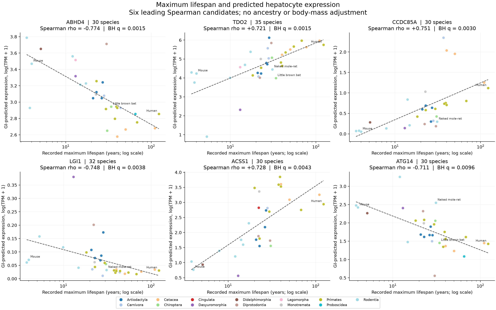

# Lifespan and predicted hepatocyte expression

These scatterplots show the six strongest Spearman candidates from the frozen 2,001-gene analysis: **ABHD4, TDO2, CCDC85A, LGI1, ACSS1 and ATG14**. Each point is one mammalian species. Lifespan is the recorded maximum from AnAge; expression is predicted from its orthologous DNA window using GI `g0-expression-8192`.



[Vector SVG](lifespan_expression.svg) · [PDF](lifespan_expression.pdf) · [Plotted observations](species_expression.csv) · [Candidate statistics](candidates.csv)

The x-axis uses a logarithmic scale. Dashed lines are ordinary regressions of predicted log(TPM+1) on log10(lifespan); panel statistics are Spearman rank correlations. Neither analysis adjusts for ancestry or body mass. Point colors identify mammalian orders for visualization only.

Spearman p values were estimated with 999,999 unrestricted permutations per gene, preserving ties. BH q values use all 3,036 planned genes as the multiple-testing family. The displayed six candidates were selected from that screen; they are exploratory associations in model predictions, not demonstrated lifespan interventions.

All species used exactly the same input context: `Homo sapiens primary hepatocytes, untreated, bulk RNA-seq.` The context and sequence name were held fixed across species. There are **187 species–gene observations** across these six genes. [Provenance](provenance.json) records the source snapshot and checksums.

To regenerate the figures from the committed CSV tables:

```bash
uv sync --extra analysis
uv run python scripts/plot_gi_candidates.py
```

An 8-bp block-shuffle experiment will test whether these associations persist after rearranging sequence near the TSS while retaining block composition. The candidate set and plotted baseline are fixed before that experiment.
