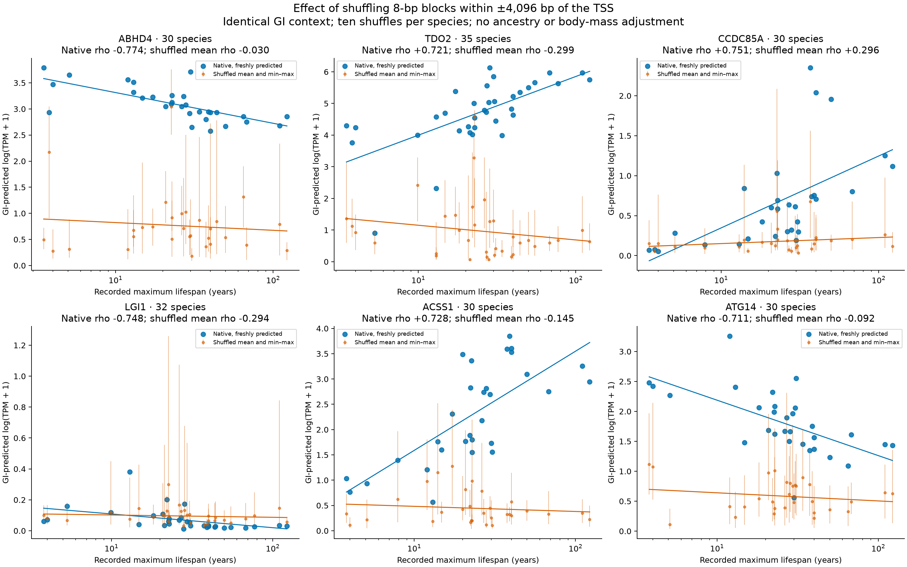
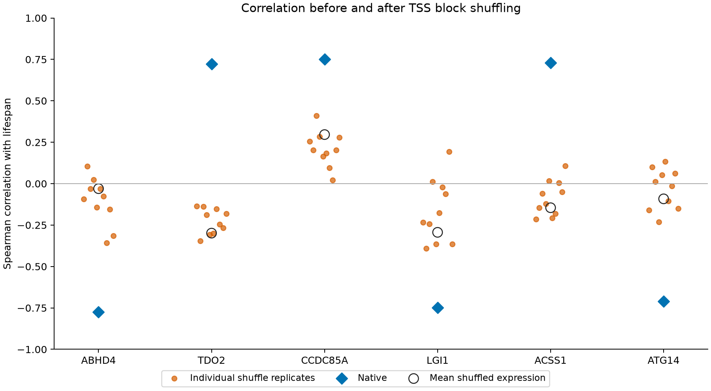

# TSS block shuffle validation

Completed genes: **6/6**. Original DNA and shuffled DNA were predicted with GI `g0-expression-8192` under the identical description `Homo sapiens primary hepatocytes, untreated, bulk RNA-seq.`. There is one fresh native control and 10 independent shuffles per species–gene pair.

Non-overlapping **8-bp blocks** were permuted separately in the 4,096-bp upstream and downstream TSS flanks. The remainder of each 81,920-bp input, its TSS index, sequence name, and context stayed fixed. Blocks containing N stayed in place. This preserves nucleotide composition and the block multiset within each flank; overlapping 8-mer counts at new junctions are not exactly preserved.

Species are the observations. Each replicate yields a correlation across the same species; the main shuffled correlation uses the mean of ten log-expression predictions per species. No ancestry or body-mass adjustment is applied. Fresh native controls check whether the API reproduces the original baseline.

| Gene | Native rho | Shuffled mean rho | Shuffled replicate range | Shuffled-mean BH q | Native minus shuffled, signed by original direction |
|---|---:|---:|---|---:|---:|
| ABHD4 | -0.774 | -0.030 | -0.358 to +0.104 | 0.8734 | +0.744 |
| TDO2 | +0.721 | -0.299 | -0.345 to -0.136 | 0.2234 | +1.020 |
| CCDC85A | +0.751 | +0.296 | +0.022 to +0.410 | 0.2234 | +0.455 |
| LGI1 | -0.748 | -0.294 | -0.391 to +0.194 | 0.2234 | +0.454 |
| ACSS1 | +0.728 | -0.145 | -0.216 to +0.107 | 0.6613 | +0.874 |
| ATG14 | -0.711 | -0.092 | -0.232 to +0.134 | 0.7542 | +0.619 |

Permutation tests use 999,999 unrestricted lifespan-rank permutations, with the +1 correction. BH q values cover the six already-selected candidates, separately for native and shuffled-mean tests. They describe these selected genes rather than a new genome-wide discovery screen. Positive signed attenuation means a weaker association in the original direction. Its exploratory 95% interval uses 20,000 paired species bootstrap samples, conditional on the estimated shuffle means; selection and phylogeny are not modeled.

A drop in expression alone does not establish loss of longevity association: correlations and species ordering are reported separately. Persistence after this local shuffle can reflect preserved sequence composition, short motifs, unperturbed distal sequence or model behavior. A loss supports dependence on the perturbed sequence organization but does not establish a causal effect on organismal lifespan. Synthetic shuffled promoters can also lie outside the model's training distribution.

All scored windows include the perturbed region: **True**. The API's scored-window bounds can vary with sequence despite fixed input length and TSS index. Here the shuffled-minus-native scored width ranges from -889 to +122 bp (mean -183.3 bp). This is an additional model-context change to consider when interpreting the perturbation. The largest absolute fresh-native versus original prediction difference is **0**.

- [Per-gene statistics](gene_summary.csv), [species comparisons](species_comparison.csv), [each replicate's correlation](replicate_correlations.csv).
- [All numeric predictions and hashes](predictions.csv), [frozen experimental protocol](protocol.json), [inference QC](inference_qc.json), [preparation provenance](preparation_provenance.json), [analysis provenance](analysis_provenance.json).
