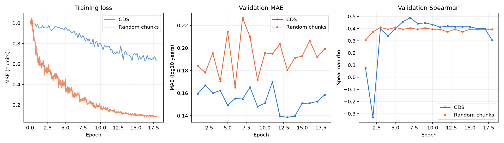
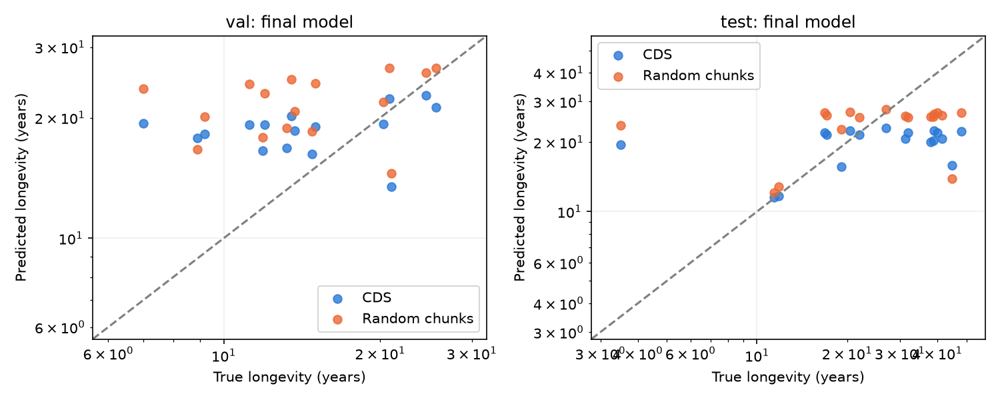

# Random genome chunks versus CDS longevity prediction

The matched random-chunk experiment completed **18 epochs / 36,000 updates**
in 172.7 training minutes. Final test species MAE was **0.1878 log10 years**,
7.7% lower than the CDS reference (0.2034). This is a single split/seed
comparison; it does not establish statistical significance or isolate compute effects.

## Final held-out results

| Split / metric | CDS | Random chunks |
| --- | ---: | ---: |
| val MAE (log10 years) | 0.1584 | 0.1993 |
| val Spearman | 0.3029 | 0.3941 |
| val Pearson | 0.2087 | 0.2335 |
| val Train-mean baseline MAE | 0.1579 | 0.1579 |
| test MAE (log10 years) | 0.2034 | 0.1878 |
| test Spearman | 0.3498 | 0.3416 |
| test Pearson | 0.3862 | 0.2992 |
| test Train-mean baseline MAE | 0.2542 | 0.2542 |

Metrics use the final checkpoint for both models. Predictions are averaged over input
examples within each species, and metrics weight species equally. The test set contains
18 species; validation contains 16. Best validation scores are reported in
[summary.json](summary.json), without selecting a checkpoint using test results.

## Controlled protocol

- Same 98 versioned assemblies, labels and training-species normalization as `longevity-anage100`.
- Exact saved 64/16/18 train/validation/test species assignments.
- 1,000 stored chunks per genome: 98,000 examples, each CLS + 1,022 DNA BPE tokens + SEP.
- Same ModernGENA ModernBERT encoder, CLS regression head, optimizer, learning rates,
  token budgets, attention backend, seed and 18 epochs. Same warmup fraction and cosine schedule.
- Genomes passed checksum verification. Historical AnAge taxonomy was frozen explicitly:
  newer NCBI metadata differs in two class and seven family annotations.
- Random chunks were sampled once with seed 0, then loaded unchanged from H5 for every epoch.

The chunk run uses 36,000 updates versus 5,040 for CDS. Different example counts,
sequence lengths and training-example species weights are inherent input differences.
This is **epoch matched, not compute matched**. The wall-clock cutoff was disabled to
complete all 18 epochs. No claim of improvement due solely to genomic location is warranted.

## Execution and reproducibility

Training ran on one NVIDIA RTX PRO 6000 Blackwell Server Edition (96 GB VRAM).
The actual environment is recorded in [environment.txt](environment.txt) and
[run_config.json](run_config.json). The verified training stack uses Torch 2.12.0,
Transformers 5.18.0 and `kernels` 0.17.2; the repository's general `model` extra alone
does not reproduce it. Transformers 5.18 matches the version stated in the CDS report.
**Historical full-software/pretrained-revision equivalence remains unverified**, as agreed.

The frozen [comparison specification](comparison.json), [input audit](input_audit.json),
[snapshot provenance](snapshot.json), [training metrics](metrics.jsonl), and per-species
[val](species_predictions_val.csv) / [test](species_predictions_test.csv) predictions
are included. Full H5 inputs and model weights remain on the shared disk under
`genes.jpg/datasets/longevity-anage100-chunks/` and
`genes.jpg/runs/longevity-anage100-chunks/model.pt`; large artifacts are not committed.

See [setup and reproduction commands](../longevity-chunks.md).
