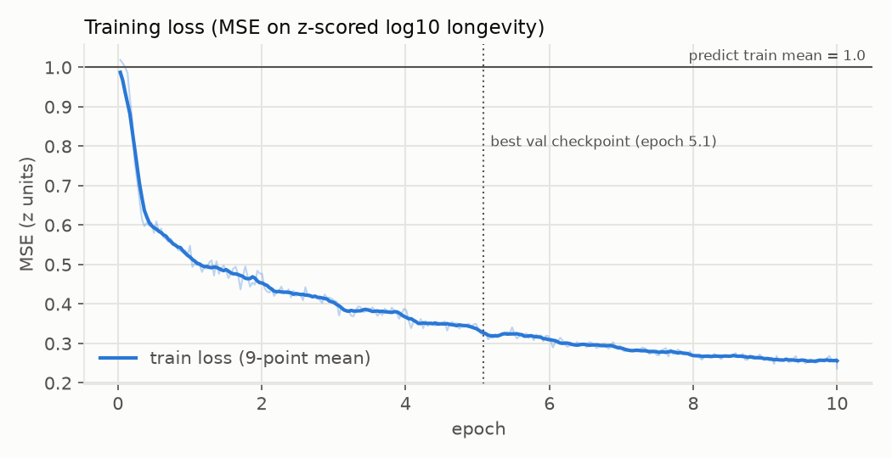
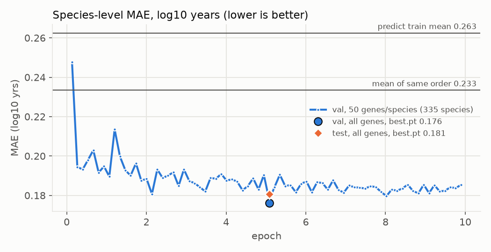
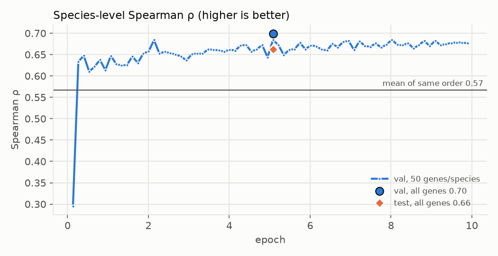
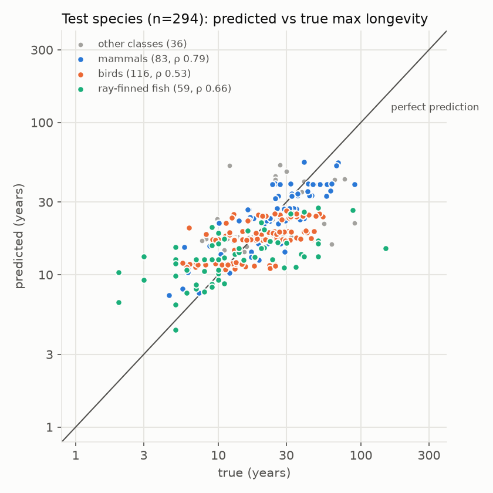

# Longevity model on 1,871 vertebrate species

This is the full-scale follow-up to the [100-genome pilot](../longevity-pilot/README.md). A ModernGENA
regressor predicts a species' AnAge maximum longevity from the genomic sequence of single
ageing-related genes; a species' prediction is the mean over its genes. Run
`longevity-agingatlas-all-genomic-10ep`, 2026-10-03/04: 10 epochs, 12.2 h on one NVIDIA RTX PRO
6000 Blackwell.

**Bottom line:** the test set is 294 species from families never seen in training. On it, the
model's species-level error is **0.181 log10 years**, a typical factor of 1.5 from the true maximum
lifespan. Its rank correlations are **Spearman ρ 0.66 and Pearson r 0.67**. Predicting the training
mean gives an error of 0.258. Predicting the mean lifespan of training species in the same
taxonomic order, which uses no sequence at all, gives 0.204 (ρ 0.53). Most of the correlation comes
from ranking species *within* a class, not from separating classes; within-class ρ on test is
0.79 for mammals, 0.66 for ray-finned fish and 0.53 for birds. The predictions are compressed,
roughly half the true spread within a class, and validation stopped improving after about two
epochs.

## Data

| | |
|---|---|
| Genes | 532 protein-coding human genes from the [Aging Atlas](https://ngdc.cncb.ac.cn/aging/age_related_genes) age-related gene sets, with mouse genes mapped to human orthologs via NCBI (`_longevity_genes/aging_atlas_genes.csv`). Only 45 genes overlap the pilot's HAGR ageing signature |
| Genomes | `data/datasets/anage-longevity` (AnAge Build 15 ↔ NCBI assemblies): all 1,898 vertebrate assemblies except amphibians and three genomes > 8 Gb |
| Gene extraction | miniprot 0.18 alignment of the longest human protein per gene; best hit per gene and species; kept if amino-acid identity ≥ 0.30 and protein coverage ≥ 0.50 |
| Input sequence | the **genomic locus from start codon to stop codon, introns included**, in the gene's orientation, stored as its first 16 kb. The model reads one 1,024-token window (~6.3 kb at 6.2 bp/token): a random window in training, the first window (starting at the start codon) at evaluation. Median locus 13 kb; 29% of genes fit entirely in the window |
| Labels | AnAge `max_longevity_yrs`, z-scored log10 years (train mean 1.234 = 17.1 yrs, SD 0.330) |
| Pairs | **860,453** (species, gene) pairs from **1,871 species** (1,872 assemblies; dog and wolf share *Canis lupus*). Species with < 200 genes found were dropped (26). Median 460 genes per species. Median identity to human: mammals 0.92, birds 0.76, reptiles 0.73, fish 0.65 |
| Classes | NCBI lineage classes. 44 species (turtles, crocodilians and others) have no NCBI class and are grouped as "NA" |

Preprocessing ran on a 192-core VM in about 1 hour; its report is in
`_longevity_genes/agingatlas_all/README.md` (all validation checks passed).

### Split

Families never straddle splits. The family assignment was done within each class, so each split
contains each major class; classes with < 10 species stay in train.

| split | species | pairs | mammals | birds | ray-finned fish | lizards and snakes | sharks and rays | other |
|---|---|---|---|---|---|---|---|---|
| train | 1,242 | 568,645 | 350 | 533 | 238 | 62 | 22 | 37 |
| val | 335 | 154,745 | 117 | 119 | 71 | 15 | 6 | 7 |
| test | 294 | 137,063 | 83 | 116 | 59 | 23 | 6 | 7 |

A family-level split does not separate orders: 243 of the 294 test species belong to an order that
also has training species. The same-order baseline below measures how much that helps.

## Model and training

| | |
|---|---|
| Encoder | `AIRI-Institute/moderngena-base` (135.7M parameters), flash-attention 2, all weights trained |
| Head | [CLS] → Linear(768, 256) → GELU → Dropout 0.1 → Linear(256, 1) |
| Loss and optimiser | MSE on the z-scored target; AdamW (β 0.9/0.98, weight decay 0.01); learning rate 3e-5 for the encoder and 1e-3 for the head; 5% warmup then cosine decay to 10%; gradient clipping 1.0; bf16 |
| Batching | length-bucketed, ≤ 32k padded tokens per batch; 14,959 steps per epoch, 149,590 in total; ~120k tokens/s, 22 GB GPU memory |
| Validation | every 2,000 steps on a fixed sample of 50 genes per validation species (16,750 pairs). The best checkpoint by species MAE was kept (`best.pt`, step 76,000 = epoch 5.1) and evaluated at the end on **all** genes of all validation and test species |

## Curves



Training loss fell from 1.0 (predicting the mean) to 0.32 at the best checkpoint and to 0.24 by
epoch 10.



Validation MAE dropped below the same-order baseline within the first 4,000 steps (0.27 epoch). It
then improved only slowly, from 0.19 to 0.18, and was essentially flat after epoch 2 while training
loss kept falling. The large markers are `best.pt` evaluated on all genes. Averaging over all ~460
genes per species instead of 50 lowers validation MAE from 0.178 to 0.176.



## Results (species level, MAE in log10 years)

| | val (335 species) | test (294 species) |
|---|---|---|
| Predict train mean | 0.263 | 0.258 |
| Predict mean of the training species in the same class | 0.260 (ρ 0.14) | 0.247 (ρ 0.31) |
| Predict mean of the training species in the same order¹ | 0.233 (ρ 0.57) | 0.204 (ρ 0.53) |
| **Model (`best.pt`, all genes)** | **0.176 (ρ 0.70, r 0.72)** | **0.181 (ρ 0.66, r 0.67)** |

¹ Falls back to the class mean when the order has no training species (val: 23 of 335 species;
test: 51 of 294).

### By class (test)

| class | species | model MAE | same-order MAE | within-class ρ, model | within-class ρ, same-order mean | true / predicted SD (log10) |
|---|---|---|---|---|---|---|
| Mammals | 83 | **0.140** | 0.160 | **0.79** | 0.65 | 0.29 / 0.20 |
| Birds | 116 | 0.170 | 0.171 | **0.53** | 0.37 | 0.23 / 0.11 |
| Ray-finned fish | 59 | **0.246** | 0.334 | **0.66** | 0.25 | 0.40 / 0.16 |
| Lizards and snakes | 23 | 0.200 | 0.203 | 0.29 | — (one order) | 0.27 / 0.05 |
| Sharks and rays | 6 | 0.258 | 0.219 | −0.23 | 0.81 | 0.21 / 0.18 |
| No NCBI class | 7 | 0.157 | 0.178 | 0.11 | 0.87 | 0.19 / 0.07 |

Validation shows the same pattern: within-class ρ is 0.66 for mammals, 0.74 for birds and 0.55 for
fish, against same-order ρ of 0.56, 0.75 and 0.22. Per-species predictions for both splits are in
[`species_predictions.csv`](species_predictions.csv).



## Conclusions

1. **Sequence carries lifespan information beyond taxonomy.** On unseen families the model beats
   the same-order baseline on both splits in MAE and rank correlation. The largest gain is in fish:
   MAE 0.25 against 0.33, within-class ρ 0.66 against 0.25.
2. **It ranks species within classes.** The class-mean baseline reaches only ρ 0.14–0.31, so the
   model's ρ ≈ 0.7 is not simply mammals versus birds versus fish. Mammals are predicted best
   (MAE 0.14, ρ 0.79 on test).
3. **Predictions are compressed.** The predicted spread within a class is 40–70% of the true
   spread, worse for fish and reptiles. Long-lived outliers are under-predicted: in test, the
   orange roughy (*Hoplostethus atlanticus*, 149 years) is predicted at 15 years, the killer whale
   (90) at 39 and the tuatara (90) at 22. This compression caps MAE and is the main target for the
   next model.
4. **More training does not help with this setup.** Validation plateaued after about two epochs and
   the best checkpoint is at epoch 5 of 10. Three to five epochs would give the same result for
   half the compute.
5. **Small groups are unreliable.** Sharks and rays, reptiles and the unclassified species have
   6–23 species per split; their numbers are noisy, and the model is at or below the taxonomy
   baselines there.

## Caveats

- AnAge maximum longevity is a single, often captive, record per species. `data_quality` and
  `sample_size` were not used as filters or weights.
- The family-level split leaves 83% of test species with relatives in the same order in training.
  Closely related genomes are not excluded; the same-order baseline is the reference for this.
- Each gene contributes only its first ~6 kb, and the species prediction is a plain mean over
  genes. Gene identity is never given to the model.
- The validation numbers used for checkpoint selection come from the validation set, so validation
  is optimistic. The test set was evaluated once.

## Next steps

- **Predict once per species:** pool per-gene embeddings (mean or attention over genes) and train on
  the species target. This should reduce compression and use cross-gene information.
- **Shorter schedules and an order-level hold-out,** to measure generalisation to new orders.
- **Body-mass (allometry) and phylogenetic-neighbour baselines.**

## Reproduce

```bash
# preprocessing (CPU): see _longevity_genes/PREPROCESS_PROMPT.md and agingatlas_all/README.md
python -m longevity.prepare --dataset data/datasets/anage-longevity \
  --anage-table data/datasets/_anage/anage_longevity_genomes.parquet \
  --genes data/datasets/_longevity_genes/aging_atlas_genes.csv \
  --human-proteins data/datasets/_longevity_genes/aging_atlas/human/ncbi_dataset/data/protein.faa \
  --out data/datasets/_longevity_genes/agingatlas_partial \
  --exclude-classes Amphibia Insecta Polychaeta Branchiopoda Malacostraca Ascidiacea \
  --max-genome-gb 8 --sequence genomic --genomic-bp 16000 \
  --min-genes 200 --val-frac 0.15 --test-frac 0.15 --split-by family --seed 0 --drop-sequences \
  --pairs-out data/datasets/_longevity_genes/agingatlas_all/pairs_genomic.parquet

# training (GPU, 12.2 h)
python -m longevity.train --data data/datasets/_longevity_genes/agingatlas_all/pairs_genomic.parquet \
  --out runs/longevity-agingatlas-all-genomic-10ep --epochs 10 \
  --eval-every-steps 2000 --eval-genes-per-species 50 --save-best --log-every 500

# this report
python -m longevity.report_full --run runs/longevity-agingatlas-all-genomic-10ep --out docs/longevity-full
```

The run directory (`best.pt`, `model.pt`, `metrics.jsonl`, `train.log`, per-pair predictions) is
`/mnt/filesystem-c8/genes.jpg/runs/longevity-agingatlas-all-genomic-10ep/`. The dataset is
`/mnt/filesystem-c8/genes.jpg/datasets/_longevity_genes/agingatlas_all/`.
