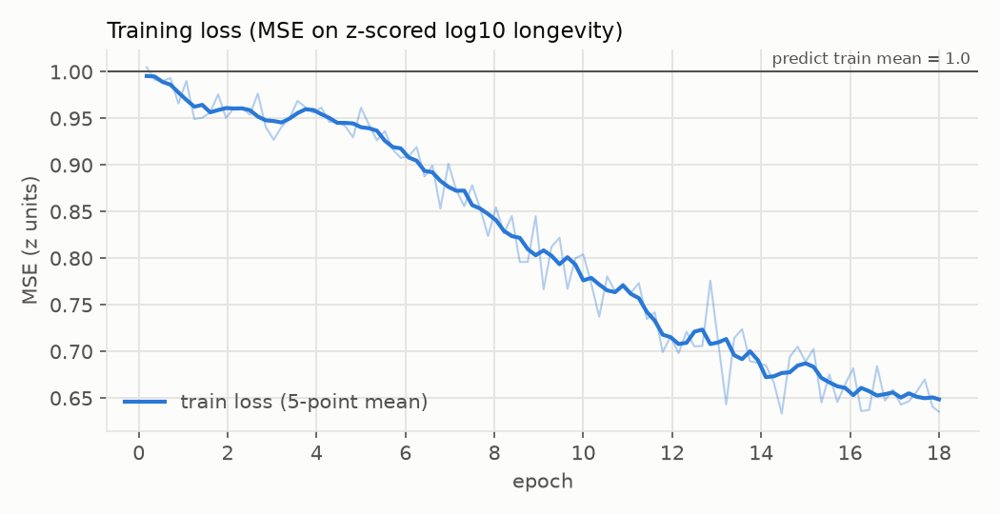
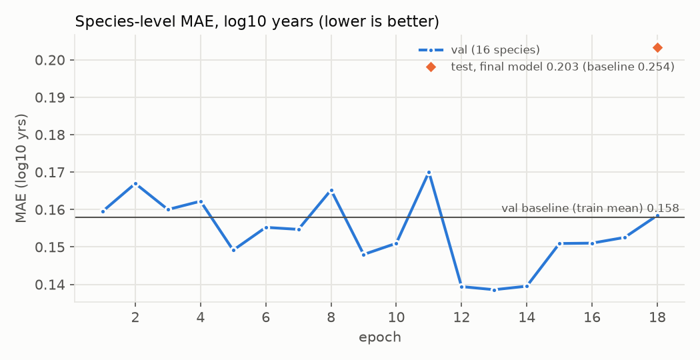
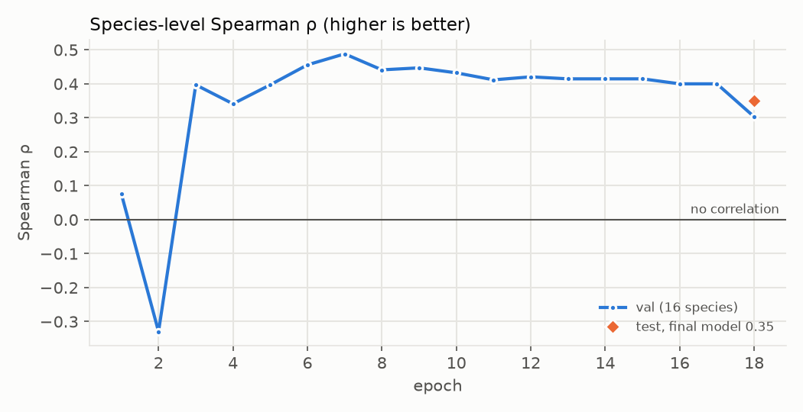
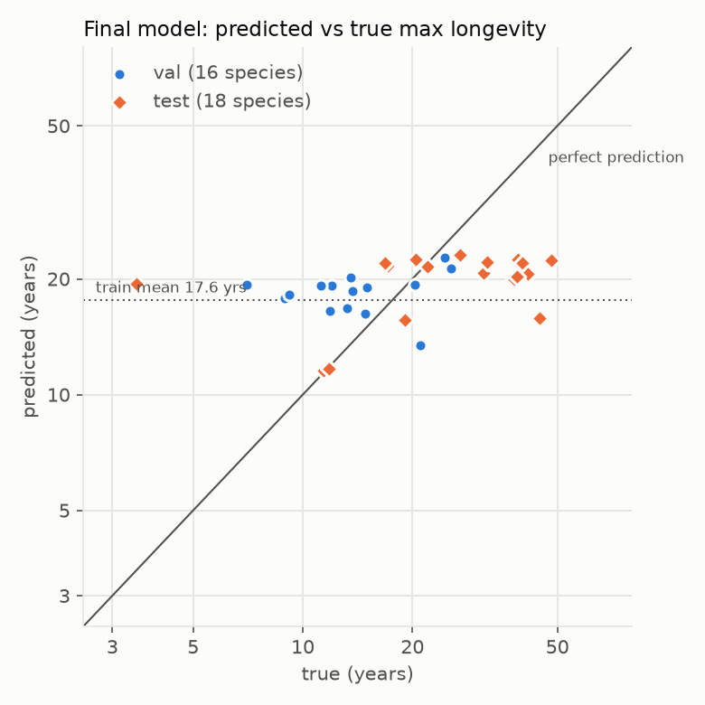

# Longevity pilot: predicting species maximum lifespan from gene sequences

Pilot run of a ModernGENA regressor that predicts a species' AnAge maximum longevity from the
coding sequence (CDS) of single ageing-signature genes. Run `longevity-anage100`, 2026-10-03,
one NVIDIA RTX PRO 6000 Blackwell (96 GB).

**Bottom line:** on 18 held-out species from families never seen in training, the model's
species-level error is 0.203 log10 years. That beats predicting the training mean (0.254) and the
mean of training species from the same order (0.228), with Spearman ρ = 0.35. But its predictions
span only 11–23 years against true values of 3.5–48. In practice it splits songbirds from large
non-passerines and cannot rank species within those groups. Treat this as a working pipeline and a
weak signal, not a lifespan predictor.

## Data

| | |
|---|---|
| Genes | 609 of the 611 HAGR [mammalian ageing-signature genes](https://genomics.senescence.info/genes/microarray.php), longest human RefSeq protein per gene (CRIPAK is a discontinued Gene ID, one more has no human protein) |
| Genomes | `data/datasets/anage-longevity` (AnAge Build 15 ↔ NCBI assemblies; see `docs/anage-longevity-sample/README.md`), the first 100 genomes downloaded, chosen to spread across orders. Amphibians, invertebrates and genomes > 8 Gb excluded |
| Gene extraction | miniprot 0.18 spliced alignment of the human proteins to each genome; best hit per gene; CDS cut from the genome; kept if amino-acid identity ≥ 0.30 and protein coverage ≥ 0.50 |
| Labels | AnAge `max_longevity_yrs`, as z-scored log10 years (train mean 17.6 yrs, SD 0.26 log10) |
| Pairs | 49,954 (species, gene) CDS from 98 species (96 birds, 2 fish), 41 families, 22 orders. Two species with < 200 genes found were dropped |
| Per species | median 524 genes, median CDS 1,182 bp = 200 tokens (5.9 bp/token), median identity to human 0.73 |
| Longevity | 3.5–70 yrs, median 17.6 |

Each training example is one (species, gene) CDS fed as `[CLS] CDS [SEP]`. A CDS longer than 1,024
tokens (2%) gets a random window in training and its first window at evaluation. Species
predictions are the mean over that species' genes.

### Split (by family, so close relatives never straddle splits)

| split | species | pairs | families | largest families | longevity, yrs (min / median / max) |
|---|---|---|---|---|---|
| train | 64 | 32,780 | 30 | Anatidae 8, Columbidae 6, Scolopacidae 5 | 5.0 / 17.0 / 70.0 |
| val | 16 | 7,905 | 8 | Falconidae 4, Charadriidae 3, Caprimulgidae 3 | 7.0 / 13.6 / 25.6 |
| test | 18 | 9,269 | 3 | Ciconiidae 8, Accipitridae 8, Muscicapidae 2 | 3.5 / 29.2 / 48.1 |

The random family assignment put all storks and all hawks/eagles in test. So test is mostly
long-lived large birds, unlike train. This makes the test set hard for a mean baseline and
favourable to any model that has learned "large non-passerine → longer-lived".

## Model and training

| | |
|---|---|
| Encoder | `AIRI-Institute/moderngena-base` (ModernBERT, 22 layers, hidden 768, **135.7M parameters**; the model card's 377M is wrong), flash-attention 2 (`kernels-community/flash-attn2`), all weights trained |
| Head | [CLS] → Linear(768, 256) → GELU → Dropout 0.1 → Linear(256, 1) |
| Loss | MSE on z-scored log10 longevity |
| Optimiser | AdamW (β 0.9/0.98, weight decay 0.01, none on norms/embeddings); learning rate 3e-5 encoder / 1e-3 head; 5% warmup then cosine decay to 10%; gradient clipping 1.0 |
| Batching | length-bucketed, ≤ 32k padded tokens per batch (~120 sequences), bf16 |
| Schedule | 18 epochs = 5,040 steps in 25.5 min at ~113k tokens/s (22 GB GPU memory); val evaluated every epoch, test once at the end |

## Curves



Training loss stayed flat near the predict-the-mean level for ~4 epochs, then fell steadily to
0.64. The model ends up explaining about a third of the training variance.



Validation MAE stays within ±0.02 of the baseline for the first 11 epochs. It is best at epochs
12–14 (0.139, 12% below the baseline) and drifts back to the baseline by epoch 18 as training loss
keeps falling. The final model is the epoch-18 model; no best checkpoint was kept. Test was
evaluated only once, on the final model (orange point), so there is no test curve.



Validation Spearman ρ settles at 0.40–0.49 from epoch 3 on. With 16 species, one swapped pair moves
ρ by about 0.03.



## Baselines and final metrics (species level, MAE in log10 years)

| | val (16 species) | test (18 species) |
|---|---|---|
| Predict train mean | 0.158 | 0.254 |
| Predict mean of training species in the same order¹ | 0.164 | 0.228 |
| Predict mean of training species in the same family | — (no family overlap by construction) | — |
| **Model, final (epoch 18)** | **0.158** | **0.203** |
| Model, best val epoch (13) | 0.139 | not evaluated |
| Spearman ρ / Pearson r, final model | 0.30 / 0.21 | 0.35 / 0.39 |

¹ Falls back to the train mean when the order is absent from train (val: 7 of 16 species have their
order in train; test: 10 of 18).

An MAE of 0.203 log10 means predictions are off by a factor of 1.6 on average (10^0.203).

### Test predictions (final model)

| species | true (yrs) | predicted (yrs) | genes |
|---|---|---|---|
| *Elanus axillaris* | 3.5 | 19.4 | 520 |
| *Luscinia svecica* | 11.4 | 11.5 | 524 |
| *Muscicapa striata* | 11.8 | 11.7 | 531 |
| *Harpia harpyja* | 16.8 | 22.0 | 535 |
| *Circus cyaneus* | 17.1 | 21.6 | 543 |
| *Mycteria ibis* | 19.1 | 15.6 | 306 |
| *Ciconia maguari* | 20.4 | 22.4 | 528 |
| *Astur gentilis* | 22.0 | 21.6 | 536 |
| *Mycteria americana* | 27.0 | 23.0 | 536 |
| *Ciconia nigra* | 31.3 | 20.7 | 504 |
| *Ciconia episcopus* | 32.0 | 22.1 | 520 |
| *Milvus milvus* | 38.0 | 20.0 | 510 |
| *Hieraaetus morphnoides* | 38.7 | 20.3 | 514 |
| *Ciconia ciconia* | 39.0 | 22.5 | 542 |
| *Gypaetus barbatus* | 40.0 | 22.0 | 537 |
| *Gyps fulvus* | 41.4 | 20.6 | 524 |
| *Leptoptilos crumenifer* | 44.7 | 15.8 | 516 |
| *Ciconia boyciana* | 48.1 | 22.3 | 543 |

## Conclusions

1. **The pipeline works end to end** and is fast: miniprot extraction takes ~1 min per bird genome
   (12 in parallel on 24 cores), tokenising 50k CDS takes 29 s, and training runs at ~113k
   tokens/s.
2. **There is a weak signal that generalises to unseen families.** On test, the model beats both
   the train-mean and the same-order baselines, and validation ρ ≈ 0.4 holds for 15 epochs.
3. **But the predictions are squeezed together** (11–23 yrs predicted vs 3.5–48 true). The model
   separates the two passerine flycatchers (≈ 11.5 yrs, correct) from storks and raptors
   (≈ 20–22 yrs). It cannot rank species within those groups: a 17-year harrier and a 48-year
   stork get the same prediction. Most of the test gain comes from this coarse split, which
   matters more because the test set is dominated by long-lived storks and raptors.
4. **The evaluation is noisy.** With 16–18 species per split, validation MAE jumps ±0.02 between
   epochs, and the test result depends heavily on which families landed there.
5. **Late epochs overfit.** Validation was best at epochs 12–14 and the final model is worse.
   Training should keep the best checkpoint by validation score.

## Next steps

- **More and more varied species.** `anage-longevity` is still downloading (~2,000 assemblies,
  including mammals and fish). Rebuilding with all non-amphibian vertebrates gives ~5× more
  species, larger splits and a wider lifespan range. The prepare stages reuse the alignments
  already done.
- **One prediction per species.** Pool gene embeddings per species (mean or attention over genes)
  and regress once, instead of averaging per-gene predictions.
- **Stronger baselines.** Add nearest-relative-in-train and body-mass (allometry) baselines, and
  repeat splits with several seeds or cross-validation to get error bars.
- **Keep the best checkpoint by validation score;** try a higher encoder learning rate given the
  slow start.

## Reproduce

```bash
# 1. gene table (CPU; ~7 min for 66 new genomes, reuses earlier alignments)
python -m longevity.prepare \
  --dataset data/datasets/anage-longevity \
  --anage-table data/datasets/_anage/anage_longevity_genomes.parquet \
  --genes data/datasets/_longevity_genes/hagr_ageing_signature_611.csv \
  --human-proteins data/datasets/_longevity_genes/human_proteins/human_611/ncbi_dataset/data/protein.faa \
  --out data/datasets/_longevity_genes/anage_partial \
  --exclude-classes Amphibia Insecta Polychaeta Branchiopoda Malacostraca Ascidiacea \
  --max-genomes 100 --pairs-out data/datasets/_longevity_genes/anage100/pairs.parquet

# 2. train (GPU; 25.5 min)
python -m longevity.train --data data/datasets/_longevity_genes/anage100/pairs.parquet \
  --out runs/longevity-anage100 --val-frac 0.15 --test-frac 0.15 --min-genes 200 \
  --epochs 18 --time-budget-min 30

# 3. this report's figures and summary.json
python -m longevity.report --run runs/longevity-anage100 --out docs/longevity-pilot
python -m longevity.progress runs/longevity-anage100   # text progress view while training
```

Requires `miniprot` and `pigz` on PATH, plus torch, transformers, kernels, pandas, pyarrow and
matplotlib. This run used transformers 5.18; the repo's `model` extra still pins `<5`. On the team
machine, `data/` is `/mnt/filesystem-c8/genes.jpg/`. The run directory (model weights, metrics,
per-pair predictions) is `/mnt/filesystem-c8/genes.jpg/runs/longevity-anage100/`. Exact numbers are
in [`summary.json`](summary.json).
