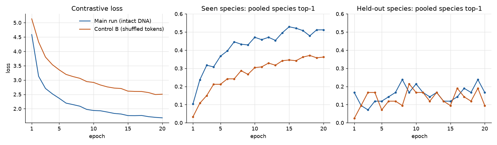
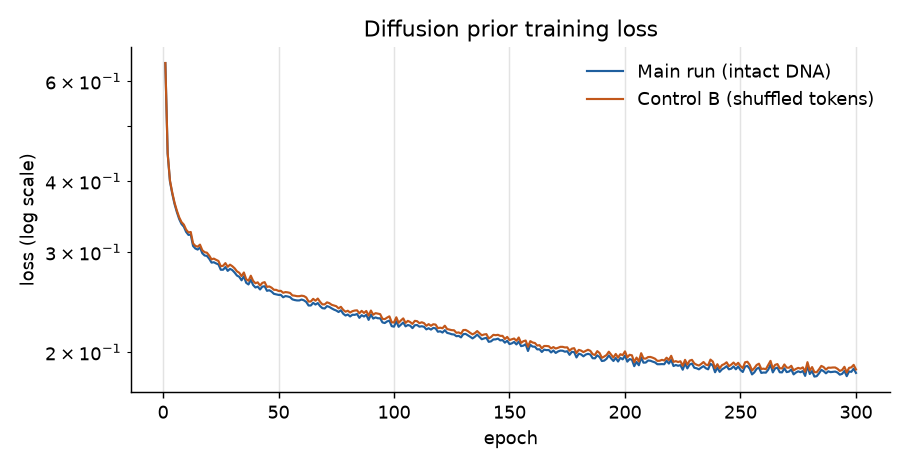
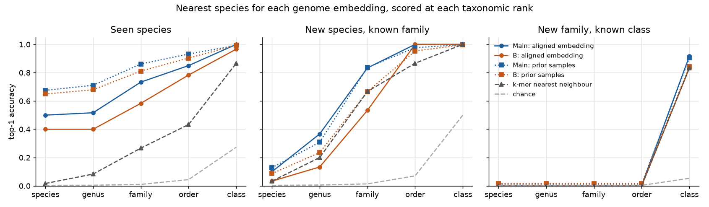
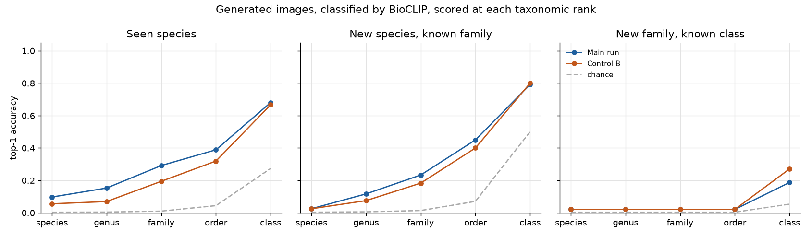
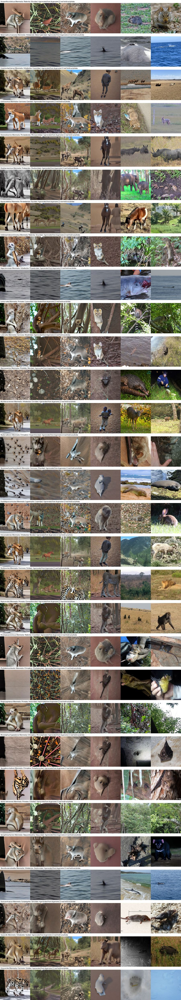
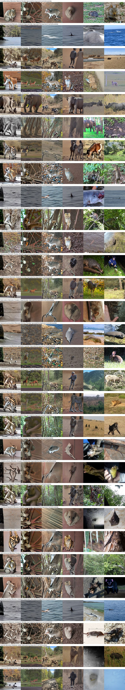
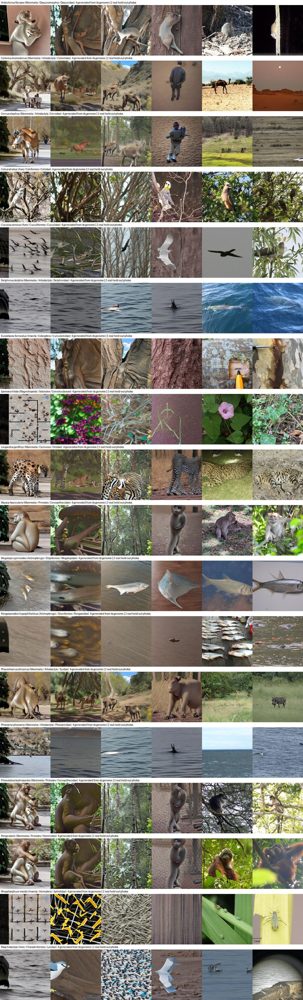
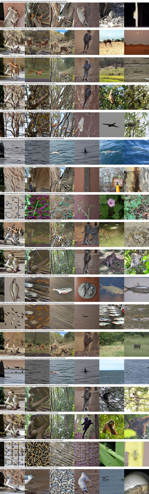
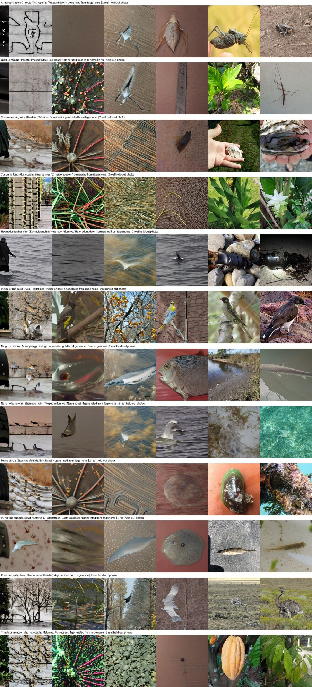
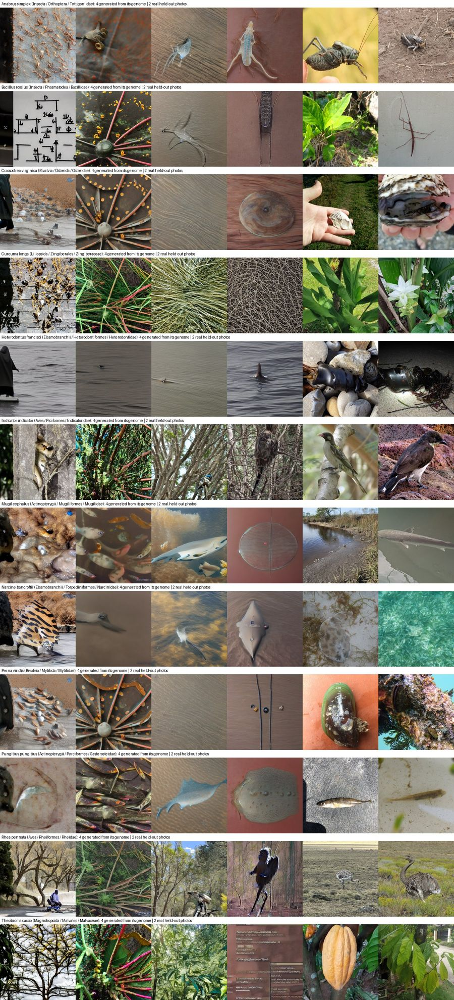

# Control B: token-order shuffle

Run date: 2026-10-03 · Report: 2026-10-04 · Dataset: `tol200m-refseq-diverse` · GPU: 1× RTX PRO 6000 Blackwell

**Result.** Shuffling the token order inside every DNA window makes the model clearly worse at telling species,
genera and families apart, but it does not reduce it to chance. For held-out species from known families, family-level
retrieval drops from 25/30 species (0.83) to 16/30 (0.53). With intact DNA the model beats the k-mer baseline (0.67);
with shuffled tokens it falls below it. Class-level accuracy barely changes. So DNA order adds real signal on top of
composition, and composition alone already carries a lot of the coarse signal.

All figures and data files are in [`control-b-shuffle-tokens/`](control-b-shuffle-tokens/), and
[`make_figures.py`](control-b-shuffle-tokens/make_figures.py) rebuilds them from the run directories.

## What control B tests

The question is whether the model uses the **order** of DNA, or only its **composition** (which tokens, and so roughly
which k-mers, a window contains).

`prepare --dna-control shuffle_tokens` tokenizes each 1024-token genome window, then randomly permutes the tokens
between `[CLS]` and `[SEP]`. The permutation is seeded per window, so fixed evaluation windows stay the same between
runs. Token counts are unchanged and their order is lost. The shuffle is stored in `align.pt`, so the prior,
the evaluation and image generation all see shuffled DNA too. The frozen-ModernGENA baseline also gets shuffled input.

Everything else is identical to the main run:

| | Main run | Control B |
|---|---|---|
| Run directory | `runs/tol200m-refseq-diverse-genome` | `runs/tol200m-refseq-diverse-genome-control-shuffle_tokens` |
| DNA input | intact 1024-token windows | same windows, token order shuffled |
| Splits, BioCLIP embeddings | same (`embeddings.pt` symlinked) | same |
| Step 1–2: alignment | 20 epochs, batch 64, seed 0 | same |
| Step 3: prior | 300 epochs, seed 0 | same |
| Step 4: decoder | Stable Diffusion 1.5, 2,500 steps on 12,000 photos | **reused from main run** (it never sees DNA) |
| Wall time | align → images done 20:56 UTC | align 116 min, prior 4 min, eval 3 min, images 5 min; done 23:26 UTC |

Because the decoder is shared, any difference in the generated images comes from the DNA embeddings alone.

### Data

| | Species | Photos |
|---|---|---|
| Training species (train) | 240 | 9,600 |
| Training species, held-out photos (val) | 240 | 2,400 |
| Held-out species (val_unseen) | 42 | 2,100 |

The 282 species span 248 animals, 30 plants and 4 fungi: 141 mammals, 27 birds, 27 ray-finned fish, 20 dicots,
12 insects and smaller groups.

The species-level evaluation scores three groups:
- **Seen:** 60 training species.
- **New species, known family:** 30 held-out species whose family is in training.
- **New family, known class:** 12 held-out species whose family is not in training.

## Training

- **Loss.** Control B starts higher (5.13 vs 4.59) and ends higher (2.51 vs 1.68) after 20 epochs. It is still
  falling slowly at epoch 20, so a longer run would close part of the gap.
- **Seen species.** Pooled species top-1 ends at 0.36 for B vs 0.51 for the main run. B trails at every epoch.
- **Held-out species.** Pooled species top-1 moves between 0.07 and 0.24 for both runs with no clear trend. With only
  42 species, one species is 0.024, so this curve is mostly noise. The final values are 0.10 (B) and 0.17 (main).

The prior trains almost identically on both: final loss is 0.186 (B) vs 0.184 (main). It learns to map whatever
embedding it gets to BioCLIP space equally well, so the loss alone can't show the difference. Held-out metrics after
the prior:

| Prior metric | Main | Control B |
|---|---|---|
| Cosine to real embedding, seen species | 0.558 | 0.544 |
| Cosine to real embedding, held-out species | 0.451 | 0.421 |
| Pooled species top-1, seen | 0.645 | 0.623 |
| Pooled species top-1, held-out | 0.125 | 0.086 |
| Pooled genus top-1, held-out | 0.228 | 0.170 |

## Evaluation: genome embedding → nearest species

Each method turns a species' genome into one or more vectors in BioCLIP image space. Each vector is matched to the
centroids of every species' held-out photos. A hit is scored at each rank: an unseen deer matched to another deer gets
genus or family credit.

Top-1 accuracy at the ranks where the runs differ most:

| Group | Method | Species | Genus | Family | Order | Class |
|---|---|---|---|---|---|---|
| Seen | Main, aligned | 0.50 | 0.52 | **0.73** | 0.85 | 1.00 |
| Seen | B, aligned | 0.40 | 0.40 | **0.58** | 0.78 | 0.97 |
| Seen | k-mer nearest neighbour | 0.02 | 0.08 | 0.27 | 0.43 | 0.87 |
| New species | Main, aligned | 0.10 | 0.37 | **0.83** | 1.00 | 1.00 |
| New species | B, aligned | 0.03 | 0.13 | **0.53** | 1.00 | 1.00 |
| New species | Main, prior | 0.13 | 0.31 | 0.84 | 0.98 | 1.00 |
| New species | B, prior | 0.09 | 0.24 | 0.67 | 0.95 | 1.00 |
| New species | k-mer nearest neighbour | 0.03 | 0.20 | 0.67 | 0.87 | 1.00 |
| New family | Main, aligned | 0.00 | 0.00 | 0.00 | 0.00 | 0.92 |
| New family | B, aligned | 0.00 | 0.00 | 0.00 | 0.00 | 0.83 |
| New family | k-mer nearest neighbour | 0.00 | 0.00 | 0.00 | 0.00 | 0.83 |

Chance is 0.004 at species level and 0.05–0.50 at class level, depending on the group. The full table, including the
caption oracle and the frozen-ModernGENA baseline, is in each run's `evaluation.json`. The caption-oracle numbers in those files were
computed before a fix to `caption_queries`: each `caption_<rank>` there is really one rank finer (`caption_genus` still
names the species). Rerun `evaluate` to refresh them. None of the numbers in this report use them.

## Generated images

The decoder renders 4 images per species from prior samples. BioCLIP then classifies each image against the same
species centroids. That covers 18 seen, 30 new-species and 12 new-family species: 72, 120 and 48 images.

| Group | Run | Species | Genus | Family | Order | Class |
|---|---|---|---|---|---|---|
| Seen | Main | 0.10 | 0.15 | 0.29 | 0.39 | 0.68 |
| Seen | B | 0.06 | 0.07 | 0.19 | 0.32 | 0.67 |
| New species | Main | 0.03 | 0.12 | 0.23 | 0.45 | 0.79 |
| New species | B | 0.03 | 0.08 | 0.18 | 0.40 | 0.80 |
| New family | Main | 0.02 | 0.02 | 0.02 | 0.02 | 0.19 |
| New family | B | 0.02 | 0.02 | 0.02 | 0.02 | 0.27 |

The gaps follow the retrieval results but are smaller, because the decoder adds its own errors on top. B's higher
class score on new families (0.27 vs 0.19) is 4 images out of 48, which is within noise.

### Contact sheets

Each row is one species. It shows 4 images generated from the genome, then 2 real held-out photos. The two runs look
alike because they share the decoder. The differences are which animal the embedding points at, not how well it is
drawn.

**New species, known family**

| Control B | Main run |
|---|---|
|  |  |

<b>Seen species</b>

| Control B | Main run |
|---|---|
|  |  |

<b>New family, known class</b>

| Control B | Main run |
|---|---|
|  |  |

The full-resolution sheets and individual images are in each run's `samples/` directory.

## Interpretation

1. **Order matters.** With order removed, the aligned embedding loses 10–15 points at species to family level on
   seen species. On new species it loses 30 points at family level (0.83 → 0.53). The model is reading more than
   token counts.
2. **The main model's lead over k-mers comes from order.** The k-mer baseline is also composition-only. Intact DNA
   beats it at family level on new species (0.83 vs 0.67). Shuffled DNA lands below it (0.53). So a shuffled model
   learns about as much as plain composition statistics, and order supplies the rest.
3. **Composition carries the coarse signal.** Order and class accuracy are almost unchanged. GC content and k-mer
   spectra separate mammals from fish or plants without any order information.
4. **The prior narrows the gap.** After the prior, B's new-species family accuracy is 0.67 vs 0.84. Prior samples
   pull toward populated regions of BioCLIP space, which helps the weaker embedding more.
5. **Pretrained ModernGENA embeddings are mostly compositional.** The frozen baseline does no worse on shuffled
   input: 0.58 vs 0.53 species top-1 on seen species. Mean-pooling a pretrained model without fine-tuning loses most
   order information anyway. Alignment training is what teaches the model to use order.

### Caveats

- One seed per run. Differences of a few points, especially on the 12 new-family species, are not reliable.
- The held-out groups are small: 30 and 12 species. One species is 3.3 and 8.3 points.
- B's loss was still falling at epoch 20. Its gap at a matched final loss could be smaller.
- Token shuffling keeps BPE token composition. That is variable-length k-mers, not a fixed-k spectrum, so it is not
  exactly the k-mer baseline's information.

## Next steps

- Train **control C** (`permute_genomes`: each species gets another species' genome). Its data is prepared in
  `runs/tol200m-refseq-diverse-genome-control-permute_genomes`, but it has not been trained yet. Held-out species
  should fall to chance if the model learns biology and not a per-species fingerprint.
- Repeat the main run and control B with 2–3 more seeds to put error bars on the gaps.
- Run B for more epochs to see whether the gap holds at a matched loss.
